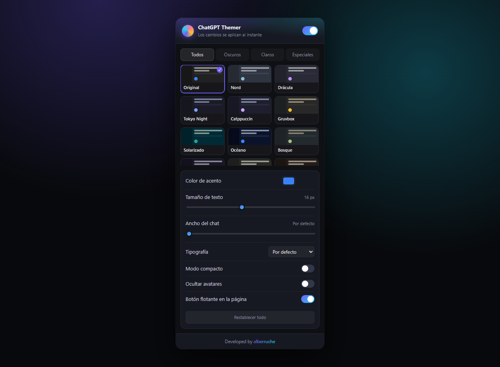
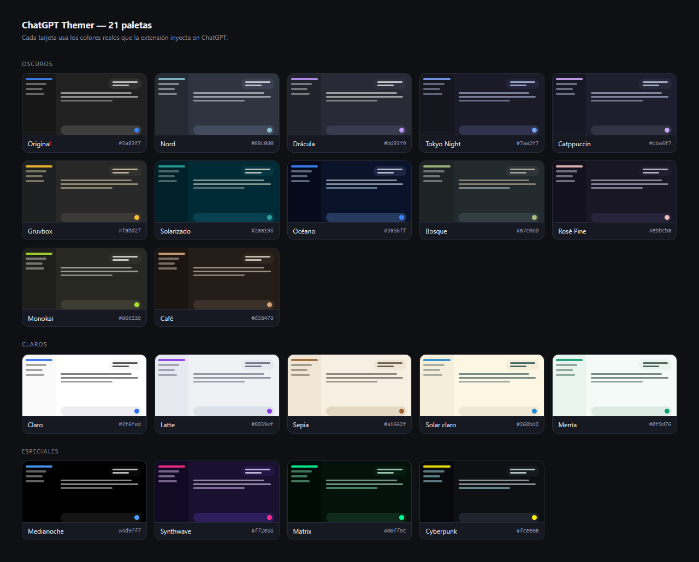
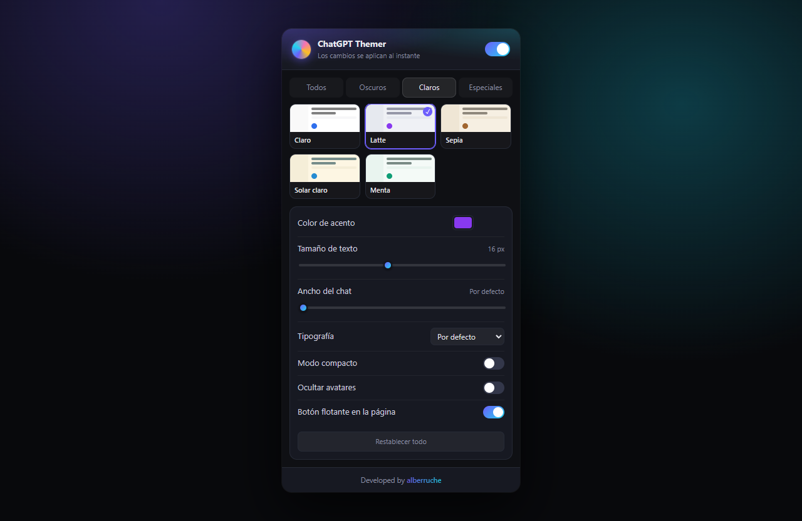
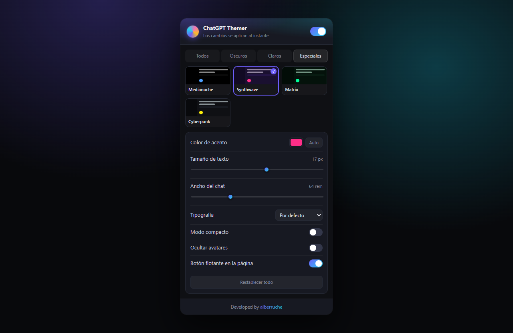

# ChatGPT Themer

Extensión de Chrome (Manifest V3) que repinta la interfaz de ChatGPT con 21 paletas,
acento personalizable y unos cuantos ajustes de lectura.



## Las 21 paletas



## Instalación (modo desarrollador)

1. Abre `chrome://extensions`.
2. Activa **Modo de desarrollador** (arriba a la derecha).
3. **Cargar descomprimida** → selecciona esta carpeta (`chatgpt_themer`).
4. Abre [chatgpt.com](https://chatgpt.com) y pulsa el icono de la extensión.

## Qué incluye

- **21 temas**: oscuros (Nord, Drácula, Tokyo Night, Catppuccin, Gruvbox, Solarizado,
  Océano, Bosque, Rosé Pine, Monokai, Café), claros (Claro, Latte, Sepia, Solar claro,
  Menta) y especiales (Medianoche/AMOLED, Synthwave, Matrix, Cyberpunk), más el original.
- **Color de acento** propio sobre cualquier tema (o `Auto` para usar el del tema).
- **Tamaño de texto**, **ancho del chat**, **tipografía**, **modo compacto** y
  **ocultar avatares**.
- **Botón flotante** dentro de la página para cambiar de tema sin abrir el popup
  (se puede desactivar).
- **Atajos**: `Alt+Shift+T` activa/desactiva, `Alt+Shift+K` pasa al siguiente tema.
- Los ajustes se guardan en `chrome.storage.sync`, así que **viajan entre tus equipos**
  y se aplican al instante en todas las pestañas abiertas.
- Aplicación en `document_start` con caché local: **sin parpadeo** al cargar.

| Temas claros | Acento propio y ajustes |
|---|---|
|  |  |

## Estructura

```
manifest.json
src/themes.js       paletas + generación del CSS (compartido por popup, content y worker)
src/content.js      inyecta el CSS y el botón flotante en chatgpt.com
src/popup.html/css/js  interfaz de la extensión
src/background.js   atajos de teclado
tools/make-icons.js genera icons/*.png sin dependencias (node tools/make-icons.js)
tools/preview/       páginas para regenerar las capturas de docs/
docs/                capturas del README
```

### Regenerar las capturas

`tools/preview/popup.html` monta el popup real fuera de Chrome (con `chrome.*`
simulado) y acepta parámetros en la URL: `?theme=latte&tab=light&accent=%23ff2e88`.
`tools/preview/palettes.html` dibuja la lámina de paletas leyendo `src/themes.js`,
así que se actualiza sola al añadir un tema.

```bash
# 1) sirve la raíz del repo en :8731 (cualquier servidor estático vale)
npx --yes serve -l 8731 .
# 2) captura con el navegador headless que prefieras, p. ej.
#    <skill>/browser.mjs http://localhost:8731/tools/preview/palettes.html \
#      --wait .card --screenshot docs/paletas.png
```

## Añadir un tema

En `src/themes.js`, dentro de `THEMES`:

```js
mitema: mk({
  name: 'Mi tema', accent: '#ff8800',
  main: '#101014',   // fondo principal
  main2: '#181820',  // burbujas / composer
  main3: '#222230',  // superficies terciarias
  side:  '#0b0b0f',  // barra lateral
  text: '#f0f0f5', text2: '#c8c8d4', text3: '#8f8fa0',
  dark: true         // false para temas claros
})
```

El popup, el botón flotante y el ciclo de temas lo recogen automáticamente.

---

Developed by [alberruche](https://alberruche.com)
